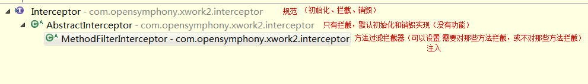

<!-- TOC depthFrom:1 depthTo:6 withLinks:1 updateOnSave:1 orderedList:0 -->

- [javaee crm](#javaee-crm)
	- [MD5加密](#md5加密)
	- [Struts2拦截器](#struts2拦截器)
	- [Struts2在Action中将数据放入值栈的几种方法](#struts2在action中将数据放入值栈的几种方法)
	- [在jsp中从值栈取值](#在jsp中从值栈取值)
	- [将数据压入值栈，在jsp中同名位置自动赋值](#将数据压入值栈在jsp中同名位置自动赋值)
	- [ajax实现部门和职务下拉选框的二级联动](#ajax实现部门和职务下拉选框的二级联动)

<!-- /TOC -->

# javaee crm

## MD5加密
	```
	public static String getMD5Value(String value) {

			try {
					//1 获得jdk提供消息摘要算法工具类
					MessageDigest messageDigest = MessageDigest.getInstance("MD5");
					//2 加密的结果10进制
					byte[] md5ValueByteArray = messageDigest.digest(value.getBytes());
					//3将10进制 转换16进制
					BigInteger bigInteger = new BigInteger(1, md5ValueByteArray);

					return bigInteger.toString(16);
			}
			catch (Exception e) {
					throw new RuntimeException(e);
			}
	}
	```

## Struts2拦截器

- 
- 实现类
	```
		public class LoginInterceptor extends MethodFilterInterceptor {
			@Override
			protected String doIntercept(ActionInvocation invocation) throws Exception {

					Object loginStaff = ActionContext.getContext().getSession().get("loginStaff");
					if (null == loginStaff) {
							((ActionSupport) invocation.getAction()).addFieldError("", "请登录");
							return "login_fail";
					}

					return invocation.invoke();
			}
		}
	```
- 配置拦截器
	```
	<package name="common" namespace="/" extends="struts-default" strict-method-invocation="false">
			<!-- 拦截器配置
					* 先声明
					* 配置
							方法1：每一个action单独使用,需要多次引用，否则默认将被覆盖
									<action name="">
											<interceptor-ref name="defaultStack"></interceptor-ref>
											<interceptor-ref name="loginInterceptor"></interceptor-ref>
									</action>
							方法2：将多个拦截器打包生成自定义栈，action使用栈
									* 自定义拦截器栈
									<interceptor-stack name="loginStack">
											<interceptor-ref name="defaultStack"></interceptor-ref>
											<interceptor-ref name="loginInterceptor"></interceptor-ref>
									</interceptor-stack>
									* action引用
									<action name="">
											<interceptor-ref name="loginStack"></interceptor-ref>
									</action>
							方法3：将自定义栈，把默认栈覆盖
									<default-interceptor-ref name="loginStack"></default-interceptor-ref>
	-->

			<interceptors>
					<interceptor name="loginInterceptor" class="com.liuhy.crm.web.interceptor.LoginInterceptor">
							<param name="excludeMethods">login</param>
					</interceptor>
					<!-- 自定义拦截器栈-->
					<interceptor-stack name="loginStack">
							<interceptor-ref name="defaultStack"></interceptor-ref>
							<interceptor-ref name="loginInterceptor"></interceptor-ref>
					</interceptor-stack>
			</interceptors>

			<!-- 修改默认的拦截器栈-->
			<default-interceptor-ref name="loginStack"/>

			<global-results>
					<!-- 如果拦截到用户没有登录，跳转到登录页面-->
					<result name="login_fail">index.jsp</result>
			</global-results>

			<!--
					action.class默认值：ActionSupport
					action.method默认值：execute
					result.name默认值
			-->
			<action name="uiAction_*_*">
					<result>WEB-INF/pages/{1}/{2}.jsp</result>
			</action>
	</package>
	```

## Struts2在Action中将数据放入值栈的几种方法
- 方式1：context (map)存放 put(key ,value) ，jsp页面获得 “#key” 。
	`ActionContext.getContext().put(key, value)`
- 方式2：root (值栈) ，push(obj) ，一般数据为JavaBean 或 Map ，jsp页面获得“属性名” 或“key”  。
- 方式3：root (值栈) ，set(key ,value) ,一般数据为List ，jsp页面获得“key”
	set() 底层 new Map(key,value) ，将 push(map )

## 在jsp中从值栈取值
	```
	<s:iterator value="#allStaff" status="vs">
			<tr class="<s:property value="#vs.even ? 'tabtd2' : 'tabtd1'"/>">
					<td align="center"><s:property value="staffName"/></td>
					<td align="center"><s:property value="gender"/></td>
					<td align="center"><s:property value="onDutyDate"/></td>
					<td align="center"><s:property value="post.department.depName"/></td>
					<td align="center"><s:property value="post.postName"/></td>
					<td width="7%" align="center">
							<a href="${pageContext.request.contextPath}/pages/staff/editStaff.jsp"></a>
					</td>
			</tr>
	</s:iterator>
	```

## 将数据压入值栈，在jsp中同名位置自动赋值

- Action
	```
	public String editUI() {
        CrmStaff editingStaff = staffService.findStaffById(staff.getStaffId());
        ActionContext.getContext().getValueStack().push(editingStaff);
        return "staff_edit";
  }
	```
- jsp
	```
	<td>登录名：</td>
  <td><s:textfield name="loginName"/></td>
	```
- 时间的处理
	```
	<s:date name="onDutyDate" var="dutyDate" format="yyyy-MM-dd"/>
  <s:textfield name="dutyDate" readonly="true" onfocus="c.showMoreDay=true; c.show(this);"/>
	```
- radio的处理
	```
	<td>
			<s:radio list="{'男', '女'}" name="gender"/>
	</td>
	```
- password的处理
	```
	<td><s:password name="loginPwd" showPassword="true"/></td>
	```
- <s:select />
	```
	<s:select list="departments"
      listValue="depName" listKey="depId"
      headerKey="" headerValue="请选择"
      name="post.department.depId"/>
	```

## ajax实现部门和职务下拉选框的二级联动

- jsp中点击发送数据事件
	```
	<tr>
      <td width="10%">所属部门：</td>
      <td width="20%">
          <s:select list="departments"
                    listValue="depName" listKey="depId"
                    headerKey="" headerValue="请选择"
                    name="post.department.depId"
                    onchange="getPostSet(this)"/>
      </td>
      <td width="8%">职务：</td>
      <td width="62%">
          <s:select list="post.department.postSet" listKey="postId" listValue="postName" name="post.postId"
                    headerKey="" headerValue="请选择" id="postSelect"/>
      </td>
  </tr>
	```
- jsp中ajax数据处理
	```
	<script>
    var postSelect = document.getElementById("postSelect");

    function getPostSet(obj) {
        var xhr = null;

        // 第一步：首先创建xhr对象
        if (window.XMLHttpRequest) {
            xhr = new XMLHttpRequest();
        } else {
            xhr = new ActiveXObject("Microsoft.XMLHTTP");
        }

        if (null != xhr) {
            var url = "${pageContext.request.contextPath}/postAction_findAllByDepartment?department.depId=" + obj.value;

            // 第二步：准备发送请求-配置发送请求的一些行为
            xhr.open("GET", url, true);

            // 第三步：指定一些回调函数
            xhr.onreadystatechange = ajaxCallback;

            // 第四步：执行发送的动作(null是为了兼容低版本浏览器)
            // get方式直接附加数据在上面的url中，post方式加在参数里
            xhr.send();
        }

        function ajaxCallback() {
            if (xhr.readyState == 4) {
                if (xhr.status == 200) {
                    var textData = xhr.responseText;
                    // 将字符串手动转换成json对象
                    var jsonData = eval("(" + textData + ")");

                    // 向postSelect中填数据
                    for (var i = postSelect.options.length - 1; i >= 1; i--) {
                        postSelect.remove(i);
                    }
                    for (var i = 0; i < jsonData.length; i++) {
                        var postId = jsonData[i].postId;
                        var postName = jsonData[i].postName;

                        var item = new Option(postName,postId);
                        postSelect.options.add(item);
                    }
                }
            }
        }
    }
	</script>
	```
- Action中使用Google-json将对象转换成json并发送回去
	```
	/*
        * ajax 根据department查询并返回所有post
        * json格式的数据
        * */
    public String findAllByDepartment() throws IOException {

        Set<CrmPost> postSet = postService.findAllByDepartment(post.getDepartment());

        // 排除CrmPost中的CrmDepartment
        ExclusionStrategy strategy = new ExclusionStrategy() {
            @Override
            public boolean shouldSkipField(FieldAttributes f) {
                return CrmDepartment.class.equals(f.getDeclaredClass());

            }

            @Override
            public boolean shouldSkipClass(Class<?> clazz) {
                return CrmDepartment.class.equals(clazz);
            }
        };
        Gson gson = new GsonBuilder()
                .setExclusionStrategies(strategy)
                .create();

        String result = gson.toJson(postSet);

        HttpServletResponse response = ServletActionContext.getResponse();
        response.setCharacterEncoding("utf-8");
        PrintWriter out = response.getWriter();
        out.print(result);
        out.flush();
        out.close();

        return "none";
    }
	```
